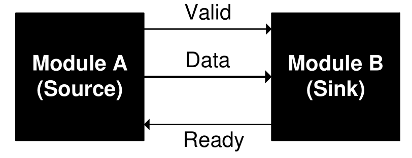
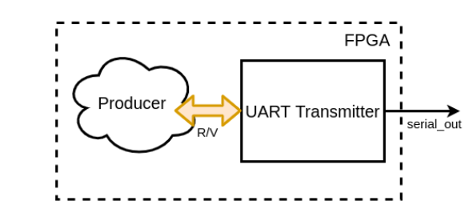

# FPGA Lab 5: UART, FIFO, Memory Controller
<p align="center">
Prof. Sophia Shao
</p>
<p align="center">
TAs: (ordered by section) Yikuan Chen, Simon Guo, Jennifer Zhou, Paul Kwon, Ella Schwarz, Raghav Gupta
</p>
<p align="center">
Department of Electrical Engineering and Computer Science
</p>
<p align="center">
College of Engineering, University of California, Berkeley
</p>

## Before You Begin
### Fetch Latest Lab Skeleton
```shell
cd fpga_labs_fa22
git pull origin master
```

### Copy Sources From Previous Lab
```shell
cd fpga_labs_fa22
cp lab4/src/synchronizer.v lab5/src/.
cp lab4/src/edge_detector.v lab5/src/.
cp lab4/src/debouncer.v lab5/src/.
```

### Reading
- Read this document on [ready-valid interfaces](https://inst.eecs.berkeley.edu/~eecs151/fa21/files/verilog/ready_valid_interface.pdf)

## Overview

This lab is divided into 2 parts.

### Part 1 (released 10/04)

- Understand the ready-valid interface
- Design a universal asynchronous receiver/transmitter (UART) circuit
- Design a first-in-first-out (FIFO) circuit 

No FPGA testing for this part.

### Part 2 (released 10/11)
- Connect the FIFO and UART circuits together, bridging two ready-valid interfaces 
- Design a memory controller that takes read and write commands from a FIFO, interacts with a synchronous memory accordingly, and returns read results over another FIFO.
- Extra Credit: Building a Fixed Note Length Piano

This part will involve a working design on FPGA.

## Aside: Recommended Style for Writing a Finite State Machine - Mulitple Always Blocks
```Verilog
module vending_machine(
 input clk, reset,
 input <other signals>
 output <output signals>
);
//1.define state registers (state, next_state, with proper bitwidths)

//2.define state names as localparams (optional but recommended to make your code clean)
//e.g.
localparam DEFAULT_STATE = 2'b00;

//3.declare regs for output that will be produced by the combinational block
//e.g. do this. Note that output_1_reg is still an combinational logic, not a sequential logic!
reg output_1_int; //int for internal
assign output_1 = output_1_int;

//4.an always@(posedge clk) block to handle state assignment
always @ (posedge clk) begin
  state <= next_state; // For this example, this is the only line that should be in this block. For reset, see the combinational block below
  // Note that any sequential (flipflops) elements must be in posedge clk block (counter, accumulator, state etc.)
end

//5.one or more always@(*) blocks to handle 1) output for each state and 2) state transition logic (both of them may also depend on input)
always @ (*) begin
  if(reset)begin
     next_state = DEFAULT_STATE; 
  end else begin
    case(state)
      DEFAULT_STATE: begin
        output_1_int = 1'b1;
        if(input_1) next_state = ...;
        else next_state = ...;
      end
      ...
    endcase
  end 
end

```

## Ready-Valid Interface
Often, we want to design modules that pass data between each other but are unaware of each other's internal timing.
The *ready-valid interface* is a standardized interface and protocol for timing-agnostic data movement between 2 modules.

The ready-valid interface is used to send data from a *source* to a *sink*.

<p align=center>
  
</p>

It consists of 3 wires:
  - `valid` (1 bit, driven by source, received by sink)
  - `data` (D bits, driven by source, received by sink)
  - `ready` (1 bit, driven by sink, received by source)

The sink uses the `ready` signal to tell the source if the sink is able to receive a new piece of data.
Usually the sink can only take in a certain number of data pieces until it is full and has to process what it has already received before it can receive any more.

The source uses the `valid` signal to tell the sink that the `data` bus has data it wishes to send to the sink.

A ready-valid *transaction* only occurs when both `ready` and `valid` are high on a rising clock edge.
If both `ready` and `valid` are high on a rising edge, the source can assume that the sink has received and *internally stored* the bits on `data`.

Here are a few examples:
<!--
wavedrom.com/editor.html
{signal: [
  {name: 'clk', wave: 'p......'},
  {name: 'data', wave: 'x3x33x.', data: ['a', 'x', 'b']},
  {name: 'valid', wave: '010.10.'},
  {name: 'ready', wave: '1......'}
]}
Save a .svg from the wavedrom webapp
Then to convert to .png
rsvg-convert image.svg -f pdf -o image.pdf
convert -density 300 image.pdf image.png
-->

<p align=center>
  
</p>

There are two transactions that take place on the 3rd and 6th rising clock edges.
Note that the source can change `data` when `valid` is not high.

<p align=center>
  
</p>
<!--
{signal: [
  {name: 'clk', wave: 'p......'},
  {name: 'data', wave: 'x3..3.x', data: ['a', 'b']},
  {name: 'valid', wave: '01....0'},
  {name: 'ready', wave: '10.1010'}
]}
-->

The sink can pull `ready` low whenever it isn't ready to accept new data.
In this example, there are 2 transactions that take place on the 5th and 7th rising clock edges.
When the source has `valid` high, but the sink has `ready` low we say that the sink is applying *backpressure* to the source.

The data transfer from source to sink only occurs when *both* `ready` and `valid` are high on a rising edge.

## UART Serial Device
In this lab, we will design a circuit that implements UART serial protocol for transmitting and receiving data over a serial interface.
This will enables circuits on the FPGA to communicate with the workstation, which will allow us to programmatically send data to and from the FPGA.

UART is a 2 wire protocol with one wire carrying data from the workstation → FPGA and the other one carrying data from the FPGA → workstation.
Here is an overview of the setup we will use:

<p align=center>
  
</p>
<p align=center>
  <em>Diagram of the entire setup</em>
</p>

The UART transmit and receive modules use a *ready-valid interface* to communicate with other modules on the FPGA.
Both the UART’s receive and transmit modules will have their own separate ready-valid interface connected appropriately to other modules.

Please note that the serial line itself is not a ready/valid interface.
Rather, it is the modules you will work with in this lab (`uart_transmitter` and `uart_receiver`) that use the ready-valid handshake.

### UART Packet Framing
On the `PYNQ-Z1` board, the physical signaling aspects (such as voltage level) of the serial connection will be taken care of by off-FPGA devices.
From the FPGA's perspective, there are two signals, `FPGA_SERIAL_RX` and `FPGA_SERIAL_TX`, which correspond to the receive-side and transmit-side pins of the serial port.
The FPGA's job is to correctly frame 8-bit data words going back and forth across the serial connection.
The figure below shows how a single 8-bit data word is transferred over the serial line using the UART protocol.

<p align=center>
  
</p>
<p align=center>
  <em>Framing of a UART packet</em>
</p>

In the idle state the serial line is held high.
When the TX side is ready to send a 8-bit word, it pulls the line low.
This is called the start bit.
Because UART is an asynchronous protocol, all timing within the frame is relative to when the start bit is first sent (or detected, on the receive side).

The frame is divided up in to 10 uniformly sized bits: the start bit, 8 data bits, and then the stop bit.
The width of a bit in cycles of the system clock is given by the system clock frequency (`125 MHz`) divided by the baudrate.
The baudrate is the number of bits sent per second; in this lab the baudrate will be **115200**.
Notice that both sides must agree on a baudrate for this scheme to be feasible.

### UART Receiver
<p align=center>
  
</p>
<p align=center>
  <em>Connectivity of the UART receiver</em>
</p>

The receive side of the UART is just a shift register that shifts bits in from the serial line.
However, care must be taken into determining *when* to shift bits in.
If we attempt to sample the `FPGA_SERIAL_RX` signal directly on the edge between two symbols, we are likely to sample on the wrong side of the edge and get the wrong value for that bit.
One solution is to wait halfway into a cycle (until `SampleTime` on the diagram) before reading a bit in to the shift register.

The UART receiver module sends the received 8-bit word to a consumer block on the FPGA via a ready-valid interface.
Once we have received a full UART packet over the serial port, the `valid` signal should go high until the `ready` signal goes high, after which the `valid` signal will be driven low until we receive another UART packet.

You do not need to implement the UART receiver as it is provided to you in `lab5/src/uart_receiver.v`, but you should refer to its implementation when writing the `uart_transmitter`.

### UART Transmitter
<p align=center>
  
</p>
<p align=center>
  <em>Connectivity of the UART transmitter</em>
</p>

The UART Transmitter receives a 8-bit word from a producer block on FPGA via the ready-valid interface.
Once we have a 8-bit word that we want to send (i.e., once `valid` is high, and the transmitter is `ready`), transmitting it involves shifting each bit of the `data[7:0]` bus, plus the start and stop bits, out of a shift register on to the serial line.

Remember, the serial baudrate is much slower than the system clock, so we must wait `SymbolEdgeTime = ClockFreq / BaudRate` cycles between changing the bit we're putting on the serial line.
After we have shifted all 10 bits out of the shift register, we are done unless we have to send another frame immediately after.
The transmitter should not be `ready` when it is in a middle of sending a frame.

**Your task** is to complete the implementation of UART transmitter in `lab5/src/uart_transmitter.v`.

### UART Transmitter Verification
We have provided 2 testbenches to check the UART transmitter.
  - `sim/uart_transmitter_tb.v`
  - `sim/uart2uart_tb.v`

You can run them as usual; they will print out any errors during execution.

## FIFO
A FIFO (first in, first out) data buffer is a circuit that allows data elements to be queued through a write interface, and read out sequentially by a read interface.
The FIFO we will build in this section will have both the read and write interfaces clocked by the same clock; this circuit is known as a synchronous FIFO.

### FIFO Functionality
A FIFO is implemented with a circular buffer (2D reg) and two pointers: a read pointer and a write pointer.
These pointers address the buffer inside the FIFO, and they indicate where the next read or write operation should be performed.
When the FIFO is reset, these pointers are set to the same value.

When a write to the FIFO is performed, the write pointer increments and the data provided to the FIFO is written to the buffer.
When a read from the FIFO is performed, the read pointer increments, and the data present at the read pointer's location is sent out of the FIFO.

A comparison between the values of the read and write pointers indicate whether the FIFO is full or empty.
You can choose to implement this logic as you please.
The `Electronics` section of the [FIFO Wikipedia article](https://en.wikipedia.org/wiki/FIFO_(computing_and_electronics)) will likely aid you in creating your FIFO.

Here is a block diagram of a FIFO similar to the one you should create, from page 103 of the [Xilinx FIFO IP Manual](https://www.xilinx.com/support/documentation/ip_documentation/fifo_generator_ug175.pdf).

<p align=center>
  
</p>

The interface of our FIFO will contain a *subset* of the signals enumerated in the diagram above.

### FIFO Interface
Look at the FIFO skeleton in `src/fifo.v`.

The FIFO is parameterized by:
  - `WIDTH` - The number of bits per entry in the FIFO
  - `DEPTH` - The number of entries in the FIFO.
  - `POINTER_WIDTH` - Calculated as the width of the read and write pointers.

The common FIFO signals are:
  - `clk` - Clock used for both read and write interfaces of the FIFO.
  - `rst` - Reset (synchronous with `clk`); should force the FIFO to become empty.

The FIFO write interface consists of:
  - `input wr_en` - When this signal is high, on the rising edge of the clock, the data on `din` should be written to the FIFO.
  - `input [WIDTH-1:0] din` - The data to be written to the FIFO.
  - `output full` - When this signal is high, the FIFO is full.

The FIFO read interface consists of:
  - `input rd_en` - When this signal is high, on the rising edge of the clock, the FIFO should output the data indexed by the read pointer on `dout`.
  - `output [WIDTH-1:0] dout` - The data that was read from the FIFO after the rising edge on which `rd_en` was asserted.
  - `output empty` - When this signal is high, the FIFO is empty.

### FIFO Timing
The FIFO that you design should conform to the specs above.
Here is a timing diagram for a *2-entry* FIFO.
Note that the data on `dout` only changes *after the rising edge* when `rd_en` is high.

<p align=center>
  
</p>

<!--
https://wavedrom.com/editor.html
{signal: [
  {name: 'clk', wave: 'p........'},
  {name: 'wr_en', wave: '01.0.....'},
  {name: 'din', wave: 'x44x.....', data: ['a', 'b']},
  {name: 'full', wave: '0..1.0...'},
  {},
  {name: 'dout', wave: 'xxxxx5.5.', data: ['a', 'b']},
  {name: 'empty', wave: '1.0....1.'},
  {name: 'rd_en', wave: '0...1010.'}
]}
-->

### FIFO Testing
We have provided a testbench in `sim/fifo_tb.v`.

The testbench performs the following test sequence:
- Checks initial conditions after reset (FIFO not full and is empty)
- Generates random data which will be used for testing
- Pushes the data into the FIFO, and checks at every step that the FIFO is no longer empty
- When the last piece of data has been pushed into the FIFO, it checks that the FIFO is not empty and is full
- Verifies that cycling the clock and trying to overflow the FIFO doesn't cause any corruption of data or corruption of the full and empty flags
- Reads the data from the FIFO, and checks at every step that the FIFO is no longer full
- When the last piece of data has been read from the FIFO, it checks that the FIFO is not full and is empty
- Verifies that cycling the clock and trying to underflow the FIFO doesn't cause any corruption of data or corruption of the full and empty flags
- Checks that the data read from the FIFO matches the data that was originally written to the FIFO
- Prints out test debug info

This testbench tests one particular way of interfacing with the FIFO.
Of course, it is not comprehensive, and there are conditions and access patterns it does not test.
We recommend adding some more tests to this testbench (or writing a new testbench) to verify your FIFO performs as expected.
Here are a few tests to try:
  - Several times in a row, write to, then read from the FIFO with no clock cycle delays.
      This will test the FIFO in a way that it's likely to be used when buffering user I/O.
  - Try writing and reading from the FIFO on the same cycle.
      This will require you to use fork/join to run two threads in parallel.
      Make sure that no data gets corrupted.
      
## Memory Controller

Before proceeding further, please run the following from the `lab5` directory:
```shell
git add .
git commit -m "Lab 5 Part 1"
git pull origin master
``` 

Files **you** have worked on so far in `src/` or `sim/` should be retained from your `"Lab 5 Part 1"` commit. 

Ensure the latest lab files have been pulled. In particular, make sure line 5 of `sim/mem_controller_tb.v` is the comment `/* mem_controller_tb v2 */`.

One of the key enabling blocks for the RISC-V CPU on the Final Project of this course is Memory-Mapped I/O. Specifically, we will use UART that we build in this lab to interface between a host computer and a synchronous memory block. An instance of its use is to write instructions into the instruction memory with the UART interface so our CPU can run those instructions. In this lab, we will build a simple UART-FIFO-MEMORY interface to get you familiarized with working with RAMs.

<p align=center>
  
</p>
<p align=center>
  <em>Block diagram of the system, note that the connections here are just for the purpose of illustration and do not represent all connections</em>
</p>

### Read/Write Packet
The host side (your workstation computer) will send a two-byte packet (for read operation) or a three-byte packet (for write operation) to the FPGA via UART. 
<p align=center>
  
</p>
<p align=center>
  <em>Format of data packets, write (ASCII '1' = 8'd49) is 1 on the keyboard, and read (ASCII '0' = 8'd48) is 0 on the keyboard</em>
</p>


### Operation of the Memory Controller
<!-- There are two modes of operation that you need to implement in memory_controller.v, which are controlled by SWITCH[0] on your FPGA board. -->
The role of the memory controller is to handle memory reads and writes based on the commands that the user sends from the host computer. Each operation is a multi-cycle process which consists of different states, so there will not be simultaneuous read & write cases. By "handling read or write", it means your FSM needs to set the `mem_din` (memory input data), `mem_addr` (memory address), `mem_we` (memory write enable) and FIFO communication signals properly.

1. Your memory controller FSM should start with IDLE state upon pressing the reset button. It will make a read (**the 1st byte**) from the RX FIFO whenever the `rx_fifo_empty` signal becomes 0. (Extremely Important Tip: Refer to the FIFO timing diagram to see when the FIFO's output data is valid! Remember we're using a **synchronous** FIFO.) Then, it should wait for the next packet (the address byte) to arrive at the FIFO, so it could read that byte (**the 2nd byte**). 

2. Next, depending on whether a Read (8'd48, or key 0 on the keyboard) or a Write (8'd49, or key 1 on the keyboard) command has been received for the first byte, the memory controller transitions into different states.

3. 
  - If the command was "write", then the FSM should wait for the data byte (**the 3rd byte**) to become available in the FIFO. Then it should write the data byte into the correct address in the "write memory value" state, and finally return to the IDLE state. 
  - If the command was "read", then the value at the corrsponding address should be read from the RAM, and then sent to the TX_FIFO (and the control signals should be set accordingly) in the "echo value" state, followed by returning to the IDLE state. (Extremely Important Tip: Refer to the FIFO timing diagram to see how the FIFO's input signals should be set!)

We recommend using `state_leds` to monitor current state on the FPGA. Some states will pass too quickly to be visible, but the "IDLE" and input states involve waiting 
and hence should be easily visible. We will not be testing you on the use of `state_leds`.

<p align=center>
  
</p>
<p align=center>
  <em>Flow diagram of the FSM, note that transitions back to the current state are not shown here</em>
</p>

Keep in mind the input bytes might not be sent back-to-back, **so your FSM has to wait in the current state until it receives the next byte**.

We have provided you with a skeleton for the FSM. You will see it is structured using multiple always blocks: 
1. state register update (`always @ (posedge clk)`)
2. next state logic (`always @ (*)`)
3. output logic (`always @ (*)`)
4. byte reading & packet counting, if needed (`always @ (posedge clk)`)

Please feel free to use a different number of states, or different states, as long as you completely understand the required behavior and the design of your FSM. 

In some FSM implementations, you could see people combining 2 & 3 into the same `always@(*)` block. It is just personal preference. In our lab, we recommend that you split them into two blocks.

<!--
One thing to keep in mind while implementing your memory controller FSM is that, since the FIFO uses synchronous read, the data will be available one clock cycle after "rx_fifo_rd_en" is asserted, so you need to read that byte at the correct time.
-->

### Running the testbench
Once you finish the mem_controller.v, ensure line 5 of `sim/mem_controller_tb.v` is the comment `/* mem_controller_tb v2 */` and run the following to test its behavior:
```shell
make sim/mem_controller_tb.vpd
dve -vpd sim/mem_controller_tb.vpd &
```

Note that both `mem_controller_tb.v` and `system_tb.v` requrie a correct fifo to interface with the memory controller.

If you see all tests passed, proceed to testing the system level. If the simulation doesn't finish (gets stuck), press `ctrl+c` and type `quit`, then open up the `dve` tool to check the waveform. Does the timing of each state transition and control signal look correct (refer to the FIFO timing diagram above)?

Then, run the system testbench, which requires your top level, uart, fifo, and memory controller to be all working together:
```shell
make sim/system_tb.vpd
dve -vpd sim/system_tb.vpd &
```

If everything looks correct, go ahead an program the bitstream onto the FPGA board (see next section).

<!--
**Mode 0 (echo & store):**
- The controller will look at the RX_FIFO to see if it has anything in it and will perform a read, and then load the value into RX_data_reg temporarily. This piece of data will also be written into TX_data_reg simultaneously, and the controller will send it into the TX_FIFO (if it's not full). 
- Then, the value which is temporarily stored in RX_data_reg will be written into the RAM (memory.v, which is instantiated in memory_controller.v). Your circuit should handle the byte width(8) vs word bit-width (32) problem, and should also keep track of how many characters has been stored.

**Mode 1 (sequential replay):**
- The controller should stop receiving new data from RX_FIFO in this mode. Instead, it should send whatever it has received & stored so far to the TX_FIFO in the same order as received (again, it must make sure that the TX_FIFO is not full).
- It should only do the "replay" once. 
- We will test mode 0, followed by mode 1 (once). You are not required to handle the case where we consecutively switch between mode0 and mode1 multiple times, although you are welcome to do so if you have extra time.

### Running the testbench
Run the following command from /lab5 to perform a simple test:
```shell
make sim/memory_controller_simple_tb.vpd
dve -vpd sim/memory_controller_simple_tb.vpd&
```
This test requires that you correctly handle "rx_fifo_rd_en" and "tx_fifo_wr_en" signals in both modes at the very least. Mishandling these two signals will cause your testbench to stuck in an infinite loop (and timeout).

After that, you should run the more comprehensive test.
```shell
make sim/memory_controller_tb.vpd
dve -vpd sim/memory_controller_tb.vpd&
```
This test will require that your memory controller correctly echo the data (mode 0) and also be able to replay the stored values in the correct order (same as the order at which the data was sent by the testbench).
-->


## On the FPGA
Use the standard `make impl` and `make program` to create and program a bitstream.

**Pay attention to the warnings** generated by Vivado in `build/synth/synth.log`.
It's possible to write your Verilog in such a way that it passes behavioural simulation but doesn't work in implementation.
Warnings about `multi driven nets`, for example, can lead to certain logic pathways being optimized out. Latch synthesis is another notable cause of mismatch between simulation and FPGA behavior.

### PMOD USB-UART
The PYNQ-Z1 does not have an RS-232 serial interface connected to the FPGA fabric.
So we'll be using the [PMOD USB-UART](https://store.digilentinc.com/pmod-usbuart-usb-to-uart-interface/) extension module to add a UART interface to the Pynq board.
Connect the PMOD module to the **top** row of the PMOD A port on the Pynq, and connect a USB cable from the USB-UART PMOD to your computer (this is already done in the Cory 111 workstations).

*Note:* Make sure that the power selection jumper on the PMOD USB-UART is set to LCL3V3.

<p align=center>
  
</p>
<p align=center>
  <em>PMOD USB-UART plugged in with correct power jumper setting (blue).</em>
</p>

### Hello World
Make sure `SWITCH[0]` is at "off(0)" position so you are in the memory controller mode. Reset the UART circuit on your FPGA with `buttons[0]`.

On your workstation, run:
```shell
screen $SERIALTTY 115200
```

This opens `screen`, a terminal emulator, connected to the serial device with a baud rate of 115200.
When you type a character into the terminal, it is sent to the FPGA over the `FPGA_SERIAL_RX` line, encoded in ASCII.
When the memory controller sends a new character, it will be pushed over the `FPGA_SERIAL_TX` line to your workstation computer.
When `screen` receives a character, it will display it in the terminal.

<!--- If you have a working design, you can **type a few characters into the terminal** and have them echoed to you.
Make sure that if you type really fast that all characters still display properly.--->

To test your implementation, type one character at a time. Send write packets (remember the byte corresponding to each character will be its ASCII value, ASCII charts are readily available online). Then send read packets with addresses you've written to and ensure you receive the data written earlier. 

If you see some weird garbage symbols then the data is getting corrupted and something is likely wrong. 
If you see this happening very infrequently, don't just hope that it won't happen while the TA is doing the checkoff; take the time now to figure out what is wrong.
UART bugs are a common source of headaches for groups during the final project checkpoint.

**To close `screen`, type `Ctrl-a` then `Shift-k` and answer `y` to the confirmation prompt.**
If you don't close `screen` properly, other students won't be able to access the serial port on your workstation.

If you try opening `screen` and it terminates after a few seconds with an error saying `Sorry, can't find a PTY` or `Device is busy`, execute the command `killscreen` which will kill all open screen sessions that other students may have left open.
Then run `screen` again.

Use `screen -r` to re-attach to a non-terminated screen session.
You can also reboot the computer to clear all active `screen` sessions.


## Lab Deliverables
### Lab Checkoff (due 2 weeks EoD after assigned lab section , i.e., your lab section during the week of 10/17 - 10/21)
To checkoff for this lab, have these things ready to show the TA:
  - Go through the UART simulation results and show that your UART behaves as expected. What do the testbenches do?
  - Go through the FIFO simulation results and show it works correctly.
  - Demonstrate on FPGA that it can perform write and read operations with the memory: 1. read after write, in random addresses and orders (e.g. W-R-W-R or W-W-R-R etc.)

## Personal Laptop Instructions

### Linux/OSX
After plugging in the USB cable, run `dmesg` and observe the output:
```text
[7444636.941491] ftdi_sio 1-2:1.0: FTDI USB Serial Device converter detected
[7444636.941621] usb 1-2: Detected FT232RL
[7444636.942062] usb 1-2: FTDI USB Serial Device converter now attached to ttyUSB0
```

Then connect using `sudo screen /dev/ttyUSB0 115200`

### Windows
After plugging in the USB cable, you may be prompted to install the FTDI drivers, so do that.
Follow the [steps from here](https://xilinx-wiki.atlassian.net/wiki/spaces/A/pages/18842446/Setup+a+Serial+Console) to use PuTTY to connect to the UART.


## Extra Credit - Building a Fixed Note Length Piano

### Copy Sources From Previous Lab
```shell
cd fpga_labs_fa22
cp lab4/src/nco.v lab5/src/.
cp lab4/src/dac.v lab5/src/.
```

The piano interfaces the UART with the NCO + DAC. You should be able to switch into this mode (from the memory_controller mode) by switch `SWITCH[0]` to on(1).
Its job is to fetch notes sent from the UART, convert them to a `fcw`, and send them to the `nco` (and `dac`) for a **fixed amount of time**.

<p align=center>
  
</p>
<p align=center>
  <em>Block diagram of the system with fixed-length piano</em>
</p>

**Implement `src/fixed_length_piano.v`**.
It has access to the UART transmitter FIFO, the UART receiver FIFO, and the `nco` inputs.
It also has access to a reset signal and the other buttons.

The piano should implement the following functionality:
- When the UART receiver FIFO contains a character, the FSM should pull the character from the FIFO and echo it back without modification through the UART transmitter FIFO.
- Once a character is pulled, its corresponding `fcw` should be read from the supplied `piano_scale_rom.v`.
- For a fixed amount of time (`note_length`), the note should be played by sending it to the `nco`. When a note isn't being played, the `fcw` should be set to 0
    - The `note_length` should default to 1/5th of a second, and can be changed by a fixed amount with the buttons.
    - `buttons[0]` increases the `note_length` and `buttons[1]` decreases the `note_length`
- Through doing all of this, your FSM should take care to ensure that if a FIFO is full, that it waits until it isn't full before pushing through data.
- You can use the `leds` output for debugging

You don't need to design the `fixed_length_piano` as an explicit FSM with states; the design is entirely up to you.

A ROM containing mappings from ASCII character codes to the `fcw` of the note to be played can be found in `src/piano_scale_rom.v`.

If you wish to re-generate this file, use these commands:

```bash
cd lab6
../scripts/piano_scale_generator scale.txt
../scripts/rom_generator scale.txt src/piano_scale_rom.v 256 24
# Modify piano_scale_rom.v to change the module name to 'piano_scale_rom'
```

It is possible that the UART receiver FIFO can fill up with samples so fast that the piano can't keep up; similar overflow conditions are possible with other parts of this system.
You don't need to concern yourself with detecting 'backpressure' on the entire system and can just assume that your FIFOs are large enough to buffer all the user input.

### Modify z1top
**Open up `z1top.v` and modify it** to include the new modules you wrote by uncommenting the last section of the file.
Wire up the FIFOs and your `fixed_length_piano` + `nco` + `dac` according to the block diagram in the lab intro.


<!--- You will have to add a few lines of logic (purple cloud) representing the bridge between the ready/valid interface and the FIFO's `rd_en, wr_en, full, empty` interface. ---> 

Make sure that you parameterize your FIFOs properly so that they have the proper `WIDTH` and `DEPTH`.
You can make your FIFOs as deep as you want, but 8 should be enough.

### Writing a System-Level Testbench
This design involves many moving parts that communicate with each other.
We want to make sure that the complete integration of our system works as expected.
To that end, you will have to write a system-level testbench that stimulates the top-level of your design and observes the top-level outputs to confirm correct behavior.

We have provided a template for a system testbench in `sim/system_tb.v`.
**Fill in** the `initial` block to test all the parts of the piano.

To make the waveform shorter and easier to debug, you can change the `CYCLES_PER_SECOND` parameter when instantiating `z1top` (and your `fixed_length_piano`) to something much shorter than 1/5th of a second.
You will want to check that the `fcw` being sent to the NCO is correct; you should use hierarchical paths and asserts to do this:
```verilog
assert(top.nco.fcw == 24'dxxxxx);
```

Note, you can get the integer corresponding to a ASCII character in Python (and vice versa):
```python
>>> ord('z')
122
>>> chr(122)
'z'
```

You will also want to check that the characters being sent to `z1top` are being echoed back correctly.
Use the `off_chip_uart`'s `data_out, data_out_valid, data_out_ready` interface to do this.

### FPGA Testing
Generate a bitstream and program the FPGA as usual.
Read the synthesis and implementation reports (`build/synth/synth.log`) to see if there are any unexpected warnings.

You should watch out specifically for warnings like `found x-bit latch` or `x signal unconnected` or `x signal assigned but never used`.
If you see that the synthesis tool inferred a latch, you should definitely fix that warning by completing any if-elseif-else or case statements that don't have a default signal assignment.
The other 2 warning types are dependent on your design and you should ignore them only if you know they are expected.

Once you put your design on the FPGA you can send data to the on-chip UART by using `screen $SERIALTTY 115200`.
The piano keys are mapped such that `z` through `<` go from C3 to C4 (middle C) and `q` through `i` go from C4 to C5.
Holding down shift moves the lower row's octave down and the upper row's octave up.

Use `buttons[0]` to reset the design.
Use `buttons[1]` and `buttons[2]` to change the `note_length` of your piano.

You should test the case where you make the `note_length` long, and fill up your UART FIFO by typing really fast.
Then watch your FIFO drain slowly as each note is played for `note_length` time.


## Acknowledgement
This lab is the result of the work of many EECS151/251 GSIs over the years including:
- Sp12: James Parker, Daiwei Li, Shaoyi Cheng
- Sp13: Shaoyi Cheng, Vincent Lee
- Fa14: Simon Scott, Ian Juch
- Fa15: James Martin
- Fa16: Vighnesh Iyer
- Fa17: George Alexandrov, Vighnesh Iyer, Nathan Narevsky
- Sp18: Arya Reais-Parsi, Taehwan Kim
- Fa18: Ali Moin, George Alexandrov, Andy Zhou
- Sp19: Christopher Yarp, Arya Reais-Parsi
- Fa19: Vighnesh Iyer, Rebekah Zhao, Ryan Kaveh
- Sp20: Tan Nguyen
- Fa20: Charles Hong, Kareem Ahmad, Zhenghan Lin
- Sp21: Sean Huang, Tan Nguyen
- Fa21: Vighnesh Iyer, Charles Hong, Zhenghan Lin, Alisha Menon
- Sp22: Alisha Menon, Yikuan Chen, Seah Kim
- Fa22: Yikuan Chen, Raghav Gupta, Ella Schwarz, Paul Kwon, Jennifer Zhou
